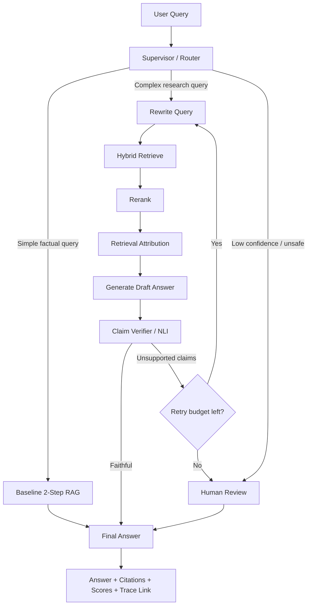

# Explainable Agentic RAG with LangGraph

A portfolio project for building a **reliable, explainable, evaluated Agentic RAG system** with LangChain, LangGraph, LangSmith, and RAGAS-style evaluation.

This repository is based on the PRP plan in `~/prp-plans/explainable-agentic-rag/` and is designed to demonstrate applied Agentic AI skills: tool calling, structured outputs, retrieval attribution, graph orchestration, verifier loops, human review, tracing, and evaluation.

> Position this as an **explainable evaluated Agentic RAG system**, not as a generic chatbot.

---

## Goals

The project demonstrates how to:

- Build a LangChain agent with typed tools, structured output, streaming, and tracing.
- Convert a RAG pipeline into an agentic workflow where retrieval is available as a tool.
- Add explainability through source/chunk attribution, retrieval scores, reranker scores, and selected-evidence rationale.
- Use LangGraph for controlled, stateful orchestration with conditional routing, retry loops, memory, checkpoints, and human-in-the-loop review.
- Evaluate answer quality using faithfulness, context precision, context recall, factual correctness, latency, and tool-call metrics.

---

## Architecture



### Main workflow

1. Classify the user query.
2. Retrieve evidence when needed.
3. Rerank and attribute selected chunks.
4. Generate a draft answer with citations.
5. Verify claims against retrieved evidence.
6. Retry with query rewriting when faithfulness is low.
7. Escalate to human review when confidence remains low.
8. Return a structured answer with sources, unsupported claims, scores, and trace metadata.

---

## Planned Features

### LangChain foundation

- Basic claim assistant agent.
- Typed tools such as `search_papers`, `summarize_claim`, and `calculate_faithfulness`.
- Pydantic structured output.
- Streaming progress events.
- LangSmith tracing.

### RAG and attribution

- Baseline retrieval → prompt → answer chain.
- Retriever exposed as an agent tool.
- Source, chunk ID, retriever score, reranker score, and reason-selected attribution.
- Comparison between baseline RAG and agentic RAG.

### LangGraph orchestration

- `StateGraph`-based workflow.
- Typed graph state.
- Nodes for classification, retrieval, relevance grading, query rewriting, answer generation, claim verification, finalization, and human review.
- Conditional routing based on retrieval quality and faithfulness score.
- Retry budget to prevent infinite loops.
- Thread-level memory and checkpointing.
- Graph-level streaming.

### Evaluation and observability

- 10–20 question evaluation set.
- Faithfulness, context precision, context recall, factual correctness, answer relevance, latency, and tool-call metrics.
- LangSmith datasets and experiment comparisons.
- RAGAS-style metric reporting.
- Trace screenshots and documented failure cases.

---

## Target Output Schema

```json
{
  "answer": "Concise answer grounded in retrieved evidence.",
  "sources": [
    {
      "doc_id": "paper-001",
      "chunk_id": "chunk-03",
      "retriever_score": 0.82,
      "reranker_score": 0.91,
      "reason_selected": "Contains direct evidence for the central claim."
    }
  ],
  "faithfulness_score": 0.87,
  "unsupported_claims": [],
  "confidence": 0.84,
  "next_action": "No follow-up needed.",
  "trace_id": "langsmith-trace-id"
}
```

---

## Suggested Repository Structure

```text
.
├── README.md
├── .env.example
├── requirements.txt
├── pyproject.toml
├── app/
│   ├── __init__.py
│   ├── main.py
│   ├── config.py
│   ├── schemas.py
│   ├── tools/
│   │   ├── retrieval_tools.py
│   │   ├── verification_tools.py
│   │   └── attribution_tools.py
│   ├── rag/
│   │   ├── ingest.py
│   │   ├── retriever.py
│   │   ├── reranker.py
│   │   └── prompts.py
│   ├── graphs/
│   │   ├── state.py
│   │   ├── nodes.py
│   │   ├── agentic_rag_graph.py
│   │   └── multi_agent_graph.py
│   └── evaluation/
│       ├── eval_dataset.jsonl
│       ├── run_ragas_eval.py
│       ├── run_langsmith_eval.py
│       └── evaluation_report.md
├── notebooks/
│   ├── 01_langchain_basic_agent.ipynb
│   ├── 02_agentic_rag_eval.ipynb
│   └── 03_langgraph_agentic_rag.ipynb
├── tests/
│   ├── test_tools.py
│   ├── test_schemas.py
│   ├── test_retrieval.py
│   └── test_graph_routes.py
└── docs/
    ├── architecture.md
    ├── langsmith_traces.md
    ├── failure_cases.md
    └── interview_cheatsheet.md
```

---

## Setup

> Implementation files are expected to follow the structure above. Once dependencies are added, use the following setup flow.

```bash
git clone <repo-url>
cd explainable-agentic-rag

python -m venv .venv
source .venv/bin/activate

pip install -r requirements.txt
cp .env.example .env
```

Example environment variables:

```bash
OPENAI_API_KEY=your_openai_key
LANGSMITH_API_KEY=your_langsmith_key
LANGSMITH_TRACING=true
LANGSMITH_PROJECT=explainable-agentic-rag
```

---

## Usage Targets

### Basic LangChain agent

```bash
python app/main.py --mode claim-assistant --query "Does reranking improve RAG faithfulness?"
```

### Agentic RAG

```bash
python app/main.py --mode agentic-rag --query "Compare baseline RAG and agentic RAG for attribution-heavy questions."
```

### LangGraph workflow

```bash
python app/main.py --mode langgraph --thread-id demo-001 --query "What evidence supports this claim?"
```

### Evaluation

```bash
python app/evaluation/run_ragas_eval.py
python app/evaluation/run_langsmith_eval.py
```

---

## Evaluation Plan

| System | Faithfulness | Context precision | Context recall | Factual correctness | Latency | Notes |
|---|---:|---:|---:|---:|---:|---|
| Baseline RAG | TBD | TBD | TBD | TBD | TBD | Retrieval → answer only |
| LangChain Agentic RAG | TBD | TBD | TBD | TBD | TBD | Retriever available as tool |
| LangGraph Agentic RAG | TBD | TBD | TBD | TBD | TBD | Controlled state, verifier loop, human review |

Evaluation should compare:

- Baseline RAG vs agentic RAG.
- Agentic RAG vs LangGraph-controlled RAG.
- Successful runs vs verifier-triggered retry runs.
- Latency and tool-call cost trade-offs.

---

## Implementation Roadmap

### Day 1 — LangChain applied foundation

- [ ] Build a basic LangChain agent.
- [ ] Add at least three typed tools.
- [ ] Add structured Pydantic output.
- [ ] Add response/progress streaming.
- [ ] Enable LangSmith tracing.

### Day 2 — RAG and evaluation

- [ ] Implement baseline RAG.
- [ ] Wrap retrieval as an agent tool.
- [ ] Add retrieval attribution.
- [ ] Create 10–20 evaluation questions.
- [ ] Run faithfulness/context evaluation.
- [ ] Add unit tests for tools, schemas, retrieval formatting, and thresholds.

### Day 3–4 — LangGraph and portfolio polish

- [ ] Define typed graph state.
- [ ] Build LangGraph nodes and conditional edges.
- [ ] Add query rewrite and verifier retry loops.
- [ ] Add memory/checkpointing.
- [ ] Add human-in-the-loop review.
- [ ] Add evaluation report, traces, failure cases, and interview notes.

---

## Interview Talking Points

This project is intended to support the following interview narrative:

> I use LangChain for fast model, tool, and structured-output integration, and LangGraph when I need deterministic control over stateful, multi-step agent workflows. In this project, I converted a RAG agent into a LangGraph workflow with retrieval, reranking, attribution, claim verification, conditional retry, memory, human review, LangSmith tracing, and faithfulness-focused evaluation.

Be prepared to explain:

1. Why LangGraph is useful beyond a simple LangChain agent.
2. How typed graph state is defined and updated.
3. How conditional edges route between retrieval, rewrite, verification, and human review.
4. How retry loops stop safely.
5. How thread memory and checkpoints work.
6. How faithfulness and unsupported claims are measured.
7. How LangSmith traces are used to debug failed runs.
8. How baseline RAG, agentic RAG, and LangGraph RAG compare.

---

## Reference Plan

Source planning document:

```text
~/prp-plans/explainable-agentic-rag/langchain_langgraph_agentic_ai_plan.md
```
