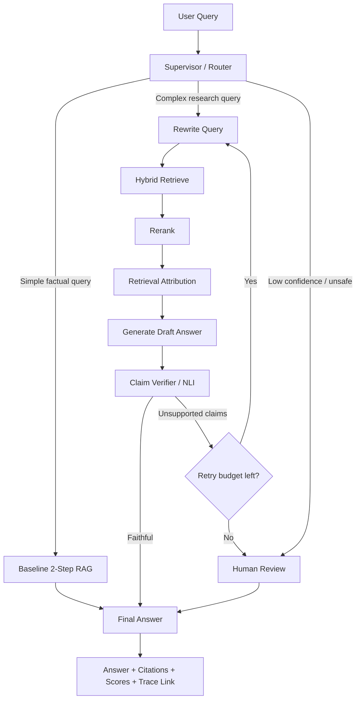

# Explainable Agentic RAG with LangGraph

A portfolio project for building a **reliable, explainable, evaluated Agentic RAG system** with LangChain, LangGraph, Phoenix/OpenTelemetry tracing, and RAGAS-style evaluation.

This repository is based on the PRP plan in `~/prp-plans/explainable-agentic-rag/` and is designed to demonstrate applied Agentic AI skills: tool calling, structured outputs, retrieval attribution, baseline-vs-agentic comparison, graph orchestration, verifier loops, human review, tracing, and evaluation.

> Position this as an **explainable evaluated Agentic RAG system**, not as a generic chatbot.

---

## Goals

The project demonstrates how to:

- Build a LangChain agent with typed tools, structured output, streaming, and tracing.
- Convert a RAG pipeline into an agentic workflow where retrieval is available as a tool.
- Add explainability through source/chunk attribution, retrieval scores, reranker scores, and selected-evidence rationale.
- Use LangGraph for controlled, stateful orchestration with conditional routing, retry loops, memory, checkpoints, and human-in-the-loop review.
- Evaluate answer quality using faithfulness, context precision, context recall, factual correctness, latency, and tool-call metrics.

---

## Current Status

Implemented so far:

- Local PDF ingestion from `docs/`.
- Chunking with stable source, page, and chunk metadata.
- In-memory vector retrieval using LangChain embeddings.
- Baseline **2-step RAG**: retrieve evidence, then answer from context.
- **Agentic RAG**: exposes retrieval as a `retrieve_documents` tool and lets the model decide when and how often to retrieve.
- Retrieval attribution metadata: source, chunk ID, page, retriever score, selected rank, reranker score, and reason-selected rationale.
- Compare-mode CLI that runs baseline and agentic RAG side by side.
- Phoenix/OpenTelemetry tracing for retrieval and model/tool spans.

Still planned:

- LangGraph-controlled verifier/retry workflow.
- Evaluation dataset and metric report.
- Human-in-the-loop review path.

---

## Architecture



### Main workflow

1. Classify the user query.
2. Retrieve evidence when needed.
3. Rerank and attribute selected chunks.
4. Generate a draft answer with citations.
5. Verify claims against retrieved evidence.
6. Retry with query rewriting when faithfulness is low.
7. Escalate to human review when confidence remains low.
8. Return a structured answer with sources, unsupported claims, scores, and trace metadata.

---

## Planned Features

### LangChain foundation

- Basic claim assistant agent.
- Typed tools such as `search_papers`, `summarize_claim`, and `calculate_faithfulness`.
- Pydantic structured output.
- Streaming progress events.
- LangSmith tracing.

### RAG and attribution

- Baseline retrieval → prompt → answer chain.
- Retriever exposed as an agent tool.
- Source, chunk ID, retriever score, reranker score, and reason-selected attribution.
- Comparison between baseline RAG and agentic RAG.

### LangGraph orchestration

- `StateGraph`-based workflow.
- Typed graph state.
- Nodes for classification, retrieval, relevance grading, query rewriting, answer generation, claim verification, finalization, and human review.
- Conditional routing based on retrieval quality and faithfulness score.
- Retry budget to prevent infinite loops.
- Thread-level memory and checkpointing.
- Graph-level streaming.

### Evaluation and observability

- 10–20 question evaluation set.
- Faithfulness, context precision, context recall, factual correctness, answer relevance, latency, and tool-call metrics.
- LangSmith datasets and experiment comparisons.
- RAGAS-style metric reporting.
- Trace screenshots and documented failure cases.

---

## Target Output Schema

```json
{
  "answer": "Concise answer grounded in retrieved evidence.",
  "sources": [
    {
      "doc_id": "paper-001",
      "chunk_id": "chunk-03",
      "retriever_score": 0.82,
      "reranker_score": 0.91,
      "reason_selected": "Contains direct evidence for the central claim."
    }
  ],
  "faithfulness_score": 0.87,
  "unsupported_claims": [],
  "confidence": 0.84,
  "next_action": "No follow-up needed.",
  "trace_id": "langsmith-trace-id"
}
```

---

## Repository Structure

Current implementation is organized to match the PRP's suggested `app/` layout
while leaving Day-2/Day-3 modules ready for incremental implementation.

```text
.
├── README.md
├── .env.example
├── pyproject.toml
├── uv.lock
├── app/
│   ├── __init__.py
│   ├── main.py
│   ├── config.py
│   ├── observability.py
│   ├── progress.py
│   ├── schemas.py
│   ├── tools/
│   │   ├── __init__.py
│   │   ├── retrieval_tools.py
│   │   ├── verification_tools.py
│   │   └── attribution_tools.py
│   ├── rag/
│   │   ├── __init__.py
│   │   ├── agentic_rag.py
│   │   ├── cli.py
│   │   ├── compare.py
│   │   ├── config.py
│   │   ├── loaders.py
│   │   ├── prompts.py
│   │   ├── retriever.py
│   │   ├── splitter.py
│   │   ├── two_step_rag.py
│   │   └── vectorstore.py
│   ├── graphs/
│   │   └── __init__.py
│   └── evaluation/
│       └── __init__.py
├── notebooks/
├── tests/
│   ├── test_rag_cli.py
│   ├── test_rag_compare.py
│   ├── test_rag_retriever.py
│   └── test_schemas.py
└── docs/
```

---

## Setup

This project uses `uv` with dependencies declared in `pyproject.toml`.

```bash
git clone <repo-url>
cd explainable-agentic-rag

uv sync
cp .env.example .env
```

Configure `.env` with your LiteLLM/OpenAI-compatible chat endpoint, embedding settings, and tracing settings:

```bash
LITELLM_MODEL=chatgpt/gpt-5.5
LITELLM_API_KEY=your_litellm_or_openai_compatible_key
LITELLM_API_BASE=https://your-litellm-or-openai-compatible-endpoint
LITELLM_STREAMING=true

OPENAI_EMBEDDING_MODEL=text-embedding-3-large
OPENAI_API_KEY=your_openai_key_for_embeddings

# Optional reranker. Disabled by default unless set to true.
RAG_USE_RERANKER=false
RAG_RERANKER_EMBEDDING_MODEL=text-embedding-3-small

PHOENIX_PROJECT_NAME=explainable-agentic-rag
PHOENIX_COLLECTOR_ENDPOINT=http://10.20.30.1:16006/v1/traces
```

---

## Usage Targets

### Day-1 Basic LangChain agent

After the package cleanup, run the agent as a module from the repository root:

```bash
uv run python3 -m app.main \
    --query "Does reranking improve RAG faithfulness?" \
    --max-results 10 \
    --stream
```

Optional JSON output:

```bash
uv run python3 -m app.main \
    --query "Does reranking improve RAG faithfulness?" \
    --max-results 10 \
    --stream \
    --json
```

### Day-2 RAG CLI

Run baseline two-step RAG:

```bash
uv run python -m app.rag.cli \
    --query "What is this project about?" \
    --mode two-step \
    --k 5
```

Run agentic RAG only:

```bash
uv run python -m app.rag.cli \
    --query "What are the main contributions of the SafeSpeech paper?" \
    --mode agentic \
    --k 5
```

Compare baseline two-step RAG with agentic RAG:

```bash
uv run python -m app.rag.cli \
    --query "What are the main contributions of the SafeSpeech paper?" \
    --mode compare \
    --k 5
```

Use raw JSON output for debugging or downstream evaluation:

```bash
uv run python -m app.rag.cli \
    --query "What are the main contributions of the SafeSpeech paper?" \
    --mode compare \
    --k 5 \
    --json
```

#### Example compare-mode result

For the SafeSpeech paper in `docs/s13278-024-01393-9.pdf`, compare mode shows the difference between fixed retrieval and agent-driven retrieval.

- **2-Step RAG** retrieves one fixed top-k set and answers from that context.
- **Agentic RAG** can issue multiple targeted retrieval calls, refine its search query, and cite more evidence chunks.

Example agentic tool calls from a successful run:

```text
1. retrieve_documents(query='SafeSpeech paper main contributions', k=5)
2. retrieve_documents(query='"In summary, the main focus of this paper" SafeSpeech evaluated datasets contributions', k=8)
3. retrieve_documents(query='"2. The proposed system is evaluated" "SafeSpeech"', k=10)
4. retrieve_documents(query='SafeSpeech contributions first system Indic languages hate content mitigation minimal annotation self explainable', k=10)
5. retrieve_documents(query='SafeSpeech datasets Hindi Tamil Marathi Malayalam experiments human evaluation case studies', k=10)
6. retrieve_documents(query='"We propose SafeSpeech" "3." "4." "main focus"', k=10)
```

The resulting answer identifies SafeSpeech's main contributions as:

- A three-module hate-speech mitigation system that classifies hate text, identifies high-intensity hateful words, and replaces them with benign alternatives before publication.
- Reduced reliance on extensive labeled data and domain experts through self-explainable techniques and minimal annotation.
- A proactive moderation approach focused on context-aware rewriting before harmful content is posted.
- Evaluation across Indic-language datasets and a mix of automatic and human evaluation.
- The authors' claim that SafeSpeech is the first system tailored for hate-content mitigation in Indic languages.

Cited chunks include `docs/s13278-024-01393-9.pdf` pages 0, 1, 6, 18, and 19.

---

## Evaluation Plan

| System | Faithfulness | Context precision | Context recall | Factual correctness | Latency | Notes |
|---|---:|---:|---:|---:|---:|---|
| Baseline RAG | TBD | TBD | TBD | TBD | TBD | Retrieval → answer only |
| LangChain Agentic RAG | TBD | TBD | TBD | TBD | TBD | Retriever available as tool |
| LangGraph Agentic RAG | TBD | TBD | TBD | TBD | TBD | Controlled state, verifier loop, human review |

Evaluation should compare:

- Baseline RAG vs agentic RAG.
- Agentic RAG vs LangGraph-controlled RAG.
- Successful runs vs verifier-triggered retry runs.
- Latency and tool-call cost trade-offs.

---

## Implementation Roadmap

### Day 1 — LangChain applied foundation

- [ ] Build a basic LangChain agent.
- [ ] Add at least three typed tools.
- [ ] Add structured Pydantic output.
- [ ] Add response/progress streaming.
- [ ] Enable LangSmith tracing.

### Day 2 — RAG and evaluation

- [ ] Implement baseline RAG.
- [ ] Wrap retrieval as an agent tool.
- [ ] Add retrieval attribution.
- [ ] Create 10–20 evaluation questions.
- [ ] Run faithfulness/context evaluation.
- [ ] Add unit tests for tools, schemas, retrieval formatting, and thresholds.

### Day 3–4 — LangGraph and portfolio polish

- [ ] Define typed graph state.
- [ ] Build LangGraph nodes and conditional edges.
- [ ] Add query rewrite and verifier retry loops.
- [ ] Add memory/checkpointing.
- [ ] Add human-in-the-loop review.
- [ ] Add evaluation report, traces, failure cases, and interview notes.

---

## Interview Talking Points

This project is intended to support the following interview narrative:

> I use LangChain for fast model, tool, and structured-output integration, and LangGraph when I need deterministic control over stateful, multi-step agent workflows. In this project, I converted a RAG agent into a LangGraph workflow with retrieval, reranking, attribution, claim verification, conditional retry, memory, human review, LangSmith tracing, and faithfulness-focused evaluation.

Be prepared to explain:

1. Why LangGraph is useful beyond a simple LangChain agent.
2. How typed graph state is defined and updated.
3. How conditional edges route between retrieval, rewrite, verification, and human review.
4. How retry loops stop safely.
5. How thread memory and checkpoints work.
6. How faithfulness and unsupported claims are measured.
7. How LangSmith traces are used to debug failed runs.
8. How baseline RAG, agentic RAG, and LangGraph RAG compare.

---

## Reference Plan

Source planning document:

```text
~/prp-plans/explainable-agentic-rag/langchain_langgraph_agentic_ai_plan.md
```
