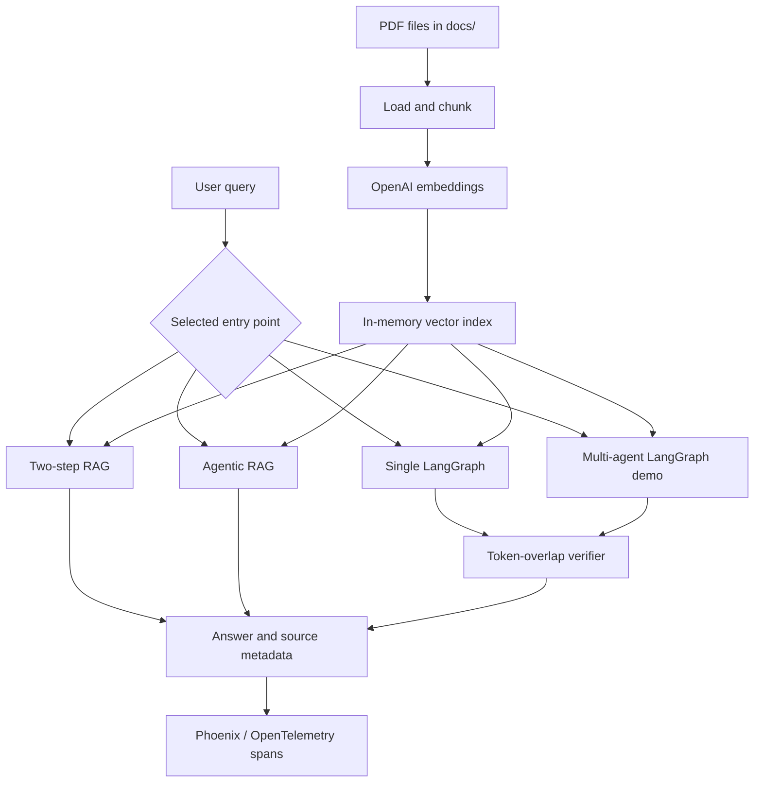

# Explainable Agentic RAG with LangGraph

An applied portfolio project for comparing document-grounded RAG workflows with
LangChain and LangGraph. The repository emphasizes retrieval attribution,
controlled orchestration, Phoenix/OpenTelemetry traces, and evaluation—not a
generic chatbot experience.

> **Maturity:** working local prototype. The core workflows run, but comparative
> evaluation evidence, robust claim verification, interactive human review,
> deployment packaging, and end-to-end tests are not complete.

## What works today

- A structured research assistant with typed tools, streaming, and arXiv search.
- Local PDF loading from `docs/`, deterministic chunk metadata, and an in-memory
  vector index built with OpenAI embeddings.
- Baseline **two-step RAG**: retrieve one top-k evidence set, then answer.
- **Agentic RAG**: expose `retrieve_documents` as a tool so the model can decide
  whether and how often to retrieve.
- A comparison CLI for running two-step and agentic RAG side by side.
- Source attribution containing file, chunk, page, retriever score, selected
  rank, optional reranker score, and a selection rationale.
- A single LangGraph workflow with classification, retrieval, rewrite/retry,
  heuristic verification, finalization, streaming, and an interrupt path.
- An orchestrator-led multi-agent graph with planner, retriever, explainer,
  verifier, route history, streamed events, and file-backed demo checkpoints.
- Phoenix/OpenTelemetry instrumentation for LangChain and retrieval spans.
- Centralized Pydantic settings for provider credentials, timeouts, retrieval
  defaults, corpus/index paths, feature flags, and Phoenix configuration.
- Ten curated evaluation questions and a RAGAS runner for the two-step baseline.
- Twenty-three local tests covering typed configuration, schemas, CLI behavior,
  comparison orchestration, retrieval configuration, and attribution.

## Important current limitations

- The index is rebuilt and the PDFs are embedded whenever a retriever is built;
  it is not persisted or incrementally updated.
- Retrieval is dense-only. The optional “reranker” is a second embedding
  similarity pass, not a cross-encoder.
- Verification uses a token-overlap heuristic from
  `calculate_faithfulness_stub`; it is not NLI or claim-level entailment.
- The single graph can interrupt for review, but its CLI path automatically
  approves the demo instead of asking the user.
- The multi-agent module runs a hard-coded demo query and does not yet expose a
  general CLI.
- RAGAS currently evaluates only two-step RAG. No generated metric report is
  checked in, so the repository does not yet demonstrate that one mode
  outperforms another.
- There is no immutable run manifest tying results to corpus hashes, settings,
  dependency lock state, and a Git commit.
- Output shapes differ between the research assistant, RAG CLI, single graph,
  and multi-agent graph.
- There is no HTTP API, web UI, CI workflow, or container deployment yet.

See [Architecture](docs/architecture.md) for current and target diagrams, and
[Troubleshooting](docs/troubleshooting.md) for common setup and runtime issues.

---

## Architecture

This diagram shows the **current** local-PDF paths. It does not represent the
planned persistent/hybrid retrieval or claim-level verifier.


```mermaid
flowchart TD
    P[PDF files in docs/] --> L[Load and chunk]
    L --> E[OpenAI embeddings]
    E --> I[In-memory vector index]

    Q[User query] --> C{Selected entry point}
    C --> B[Two-step RAG]
    C --> A[Agentic RAG]
    C --> G[Single LangGraph]
    C --> M[Multi-agent LangGraph demo]

    I --> B
    I --> A
    I --> G
    I --> M

    B --> O[Answer and source metadata]
    A --> O
    G --> V[Token-overlap verifier]
    V --> O
    M --> V

    O --> T[Phoenix / OpenTelemetry spans]
```

The two-step and agentic modes are selected directly by the RAG CLI. The two
LangGraph implementations are separate entry points; there is no production
supervisor routing among all four modes.

## Target improvements

The next programme of work is deliberately evidence-first:

1. Freeze a reproducible baseline with corpus hashes, configuration provenance,
   dependency-lock state, and dataset validation.
2. Introduce a canonical response contract and a small application-service
   boundary shared by CLI, graphs, evaluation, and future API code.
3. Evaluate all four RAG modes, including quality, retrieval, latency, cost,
   tool calls, retries, and failure rate.
4. Replace token overlap with claim-to-evidence verification.
5. Add persisted ingestion, dense plus BM25 retrieval, rank fusion, and a
   measured cross-encoder reranker.
6. Implement durable human review, followed by a thin API and explainability UI.
7. Add trace-linked experiments, CI, container deployment, and full end-to-end
   evidence.

These are targets, not claims about the current implementation. See the target
architecture in [docs/architecture.md](docs/architecture.md#target-architecture).

---

## Output contracts

There is not yet one canonical response schema.

The research assistant currently returns:

```json
{
  "answer": "Concise answer grounded in retrieved evidence.",
  "confidence": 0.82,
  "sources_used": [],
  "unsupported_claims": [],
  "next_action": "no_follow_up_needed"
}
```

The single LangGraph workflow currently returns:

```json
{
  "answer": "Concise answer grounded in retrieved evidence.",
  "sources": [
    {
      "source": "docs/paper.pdf",
      "chunk_id": "chunk-03",
      "page": 4,
      "retriever_score": 0.82,
      "reranker_score": 0.91,
      "reason_selected": "Contains direct evidence for the central claim."
    }
  ],
  "faithfulness_score": 0.87,
  "unsupported_claims": [],
  "verified": true,
  "retry_count": 0
}
```

The planned canonical contract will add schema, trace, corpus/index, route, and
verification metadata only after it is implemented and tested.

---

## Repository Structure

```text
.
├── .env.example
├── LICENSE
├── README.md
├── pyproject.toml
├── uv.lock
├── app/
│   ├── __init__.py
│   ├── main.py
│   ├── config.py
│   ├── observability.py
│   ├── progress.py
│   ├── schemas.py
│   ├── tools/
│   │   ├── __init__.py
│   │   ├── retrieval_tools.py
│   │   ├── verification_tools.py
│   │   └── attribution_tools.py
│   ├── rag/
│   │   ├── __init__.py
│   │   ├── agentic_rag.py
│   │   ├── cli.py
│   │   ├── compare.py
│   │   ├── config.py
│   │   ├── loaders.py
│   │   ├── prompts.py
│   │   ├── retriever.py
│   │   ├── splitter.py
│   │   ├── two_step_rag.py
│   │   └── vectorstore.py
│   ├── graphs/
│   │   ├── __init__.py
│   │   ├── agentic_rag_graph.py
│   │   ├── graph_hello_world.py
│   │   ├── multi_agent_graph.py
│   │   └── state.py
│   └── evaluation/
│       ├── __init__.py
│       ├── eval_dataset.jsonl
│       ├── eval_dataset_readable.md
│       └── run_ragas_eval.py
├── notebooks/
├── tests/
│   ├── test_config.py
│   ├── test_rag_cli.py
│   ├── test_rag_compare.py
│   ├── test_rag_retriever.py
│   └── test_schemas.py
└── docs/
    ├── architecture.md
    ├── troubleshooting.md
    └── *.pdf
```

Generated local state such as `.env`, `.venv/`, `.coverage`, `.ruff_cache/`,
`.rag-index/`, and `.langgraph_checkpoints/` is intentionally omitted.

---

## Prerequisites

- Python 3.11 or newer, as declared in `pyproject.toml`.
- [`uv`](https://docs.astral.sh/uv/getting-started/installation/).
- An OpenAI-compatible chat endpoint and credentials.
- An OpenAI API key for the current embedding implementation.
- Optional: Docker for a local Phoenix trace collector.

If `uv` is not installed, use its official standalone installer:

```bash
curl -LsSf https://astral.sh/uv/install.sh | sh
```

The linked `uv` installation guide above includes package-manager and Windows
alternatives.

## Setup

```bash
git clone https://github.com/neeraj1909/explainable-agentic-rag.git
cd explainable-agentic-rag
uv sync
cp .env.example .env
```

Edit `.env`. The current code uses separate chat and embedding clients:

```dotenv
# Chat model: OpenAI directly or an OpenAI-compatible/LiteLLM endpoint
LITELLM_MODEL=<chat-model-name>
LITELLM_API_KEY=<chat-api-key>
LITELLM_API_BASE=<proxy-base-url-or-empty>
LITELLM_STREAMING=true
LITELLM_TIMEOUT_SECONDS=30

# PDF indexing and retrieval embeddings
OPENAI_EMBEDDING_MODEL=text-embedding-3-large
OPENAI_API_KEY=<openai-api-key>
OPENAI_EMBEDDING_TIMEOUT_SECONDS=30

# Corpus and retrieval defaults
RAG_DOCS_DIR=docs
RAG_INDEX_DIR=.rag-index
RAG_CHUNK_SIZE=800
RAG_CHUNK_OVERLAP=120
RAG_TOP_K=4
RAG_FETCH_K_MULTIPLIER=4

# Optional second embedding-similarity ranking pass
RAG_USE_RERANKER=false
RAG_RERANKER_EMBEDDING_MODEL=text-embedding-3-small

# Phoenix/OpenTelemetry
PHOENIX_ENABLED=true
PHOENIX_PROJECT_NAME=explainable-agentic-rag
PHOENIX_COLLECTOR_ENDPOINT=http://localhost:6006/v1/traces
```

`LITELLM_API_BASE` may be left empty when the chat client connects directly to
OpenAI. The current embeddings client does not reuse `LITELLM_API_BASE`.
`RAG_INDEX_DIR` is typed now but remains reserved until persistent indexing is
implemented. Set `PHOENIX_ENABLED=false` for offline/test runs that should not
register a trace exporter.

All values are parsed by `AppSettings` in `app/config.py`. Numeric limits, URLs,
booleans, and chunk overlap are validated before provider work begins. Chat and
embedding credentials are checked only when their respective clients are
constructed, so help commands, configuration tests, and offline tooling do not
require secrets.

Validate `.env` without making provider calls:

```bash
PHOENIX_ENABLED=false uv run python -c \
    "from app.config import get_settings; get_settings(); print('configuration valid')"
```

### Start Phoenix locally

For local development, run Phoenix in a separate terminal:

```bash
docker run --rm --name phoenix \
    -p 6006:6006 \
    -p 4317:4317 \
    arizephoenix/phoenix:latest
```

Open <http://localhost:6006>. The `latest` tag is convenient for local
experimentation; a future containerized release will pin a tested version.
See the [official Phoenix Docker guide](https://arize.com/docs/phoenix/self-hosting/deployment-options/docker/)
for persistence and PostgreSQL options.

### Corpus, cost, and privacy

Every `*.pdf` directly under `docs/` is loaded. The checked-in corpus currently
contains research papers and `docs/neeraj_cv.pdf`.

- PDF chunks are sent to the configured embedding provider whenever a retriever
  is built because the current vector index is in memory.
- Queries and retrieved context are sent to the configured chat provider.
- Enabling the optional reranker creates additional embedding requests.
- The evaluation runner makes multiple model and evaluator calls across ten
  questions.

Review document licenses and remove private material before using a different
corpus or sharing traces. Do not commit `.env`; it is ignored by Git.

---

## Usage

### Research assistant

This entry point searches arXiv rather than the local PDF corpus:

```bash
uv run python -m app.main \
    --query "Does reranking improve RAG faithfulness?" \
    --max-results 10 \
    --stream
```

Optional JSON output:

```bash
uv run python -m app.main \
    --query "Does reranking improve RAG faithfulness?" \
    --max-results 10 \
    --stream \
    --json
```

It requires internet access in addition to the configured chat model.

### Local PDF RAG CLI

Run baseline two-step RAG:

```bash
uv run python -m app.rag.cli \
    --query "What is this project about?" \
    --mode two-step \
    --k 5
```

Run agentic RAG only:

```bash
uv run python -m app.rag.cli \
    --query "What are the main contributions of the SafeSpeech paper?" \
    --mode agentic \
    --k 5
```

Compare baseline two-step RAG with agentic RAG:

```bash
uv run python -m app.rag.cli \
    --query "What are the main contributions of the SafeSpeech paper?" \
    --mode compare \
    --k 5
```

Use raw JSON output for debugging or downstream evaluation:

```bash
uv run python -m app.rag.cli \
    --query "What are the main contributions of the SafeSpeech paper?" \
    --mode compare \
    --k 5 \
    --json
```

#### Example compare-mode result

For the SafeSpeech paper in `docs/s13278-024-01393-9.pdf`, compare mode shows the difference between fixed retrieval and agent-driven retrieval.

- **2-Step RAG** retrieves one fixed top-k set and answers from that context.
- **Agentic RAG** can issue multiple targeted retrieval calls, refine its search query, and cite more evidence chunks.

Example agentic tool calls from a successful run:

```text
1. retrieve_documents(query='SafeSpeech paper main contributions', k=5)
2. retrieve_documents(query='"In summary, the main focus of this paper" SafeSpeech evaluated datasets contributions', k=8)
3. retrieve_documents(query='"2. The proposed system is evaluated" "SafeSpeech"', k=10)
4. retrieve_documents(query='SafeSpeech contributions first system Indic languages hate content mitigation minimal annotation self explainable', k=10)
5. retrieve_documents(query='SafeSpeech datasets Hindi Tamil Marathi Malayalam experiments human evaluation case studies', k=10)
6. retrieve_documents(query='"We propose SafeSpeech" "3." "4." "main focus"', k=10)
```

The resulting answer identifies SafeSpeech's main contributions as:

- A three-module hate-speech mitigation system that classifies hate text, identifies high-intensity hateful words, and replaces them with benign alternatives before publication.
- Reduced reliance on extensive labeled data and domain experts through self-explainable techniques and minimal annotation.
- A proactive moderation approach focused on context-aware rewriting before harmful content is posted.
- Evaluation across Indic-language datasets and a mix of automatic and human evaluation.
- The authors' claim that SafeSpeech is the first system tailored for hate-content mitigation in Indic languages.

Cited chunks include `docs/s13278-024-01393-9.pdf` pages 0, 1, 6, 18, and 19.

### Single LangGraph workflow

Run the classifier, retrieval, rewrite/retry, heuristic verifier, and finalizer:

```bash
uv run python -m app.graphs.agentic_rag_graph \
    --query "What are the main contributions of the SafeSpeech paper?" \
    --k 5
```

Add `--json` for the raw final object or `--stream` for graph progress events.
The graph contains an interrupt-and-resume branch, but the current CLI does not
ask for a decision: it auto-approves the demo review. Treat this as a prototype
path, not a durable human-approval control.

### Multi-agent LangGraph demo

```bash
uv run python -m app.graphs.multi_agent_graph
```

This module currently uses a hard-coded question and thread ID. It streams
planner, retriever, explainer, verifier, and routing events, then stores local
demo checkpoint data under `.langgraph_checkpoints/`.

### Inspect command surfaces without model calls

These commands parse configuration and print help without embedding documents
or calling a model:

```bash
uv run python -m app.main --help
uv run python -m app.rag.cli --help
uv run python -m app.graphs.agentic_rag_graph --help
```

---

## Evaluation status

`app/evaluation/eval_dataset.jsonl` contains ten curated questions with
reference answers. Validate the dataset without making model calls:

```bash
uv run python -c \
    "from app.evaluation.run_ragas_eval import validate_eval_set; validate_eval_set(); print('evaluation dataset valid')"
```

The current RAGAS runner evaluates only two-step RAG with faithfulness, context
precision, context recall, factual correctness, and response relevance:

```bash
mkdir -p evaluation
uv run python -m app.evaluation.run_ragas_eval
```

This is a paid, networked run: it rebuilds the in-memory index, answers all ten
questions, and makes evaluator-model calls. Results are written to
`evaluation/ragas_eval_results.csv`; that directory and report are generated
artifacts and are not currently part of the repository. Comparative evaluation
across all four modes, latency, cost, tool calls, retries, and failures remains
planned.

## Tests

Run the local test suite:

```bash
uv run pytest -q
```

Run only the typed configuration tests:

```bash
uv run pytest -q tests/test_config.py
```

Ruff and pytest-cov are installed by the default development dependency group.
Inspect formatting and lint without modifying files with:

```bash
uv run ruff format --check .
uv run ruff check .
uv run pytest --cov=app
```

Do not add `--fix` when you only intend to inspect lint findings. Use
`uv sync --no-dev` only for a runtime-only environment.

---

## Implementation status

### Working prototype capabilities

- [x] Typed research tools, structured output, streaming, and Phoenix tracing.
- [x] Typed, validated, portable application configuration.
- [x] Two-step and agentic local-PDF RAG.
- [x] Retrieval attribution and optional embedding-similarity reranking.
- [x] Single and multi-agent LangGraph prototypes with bounded retries.
- [x] Ten-question dataset and two-step RAGAS runner.
- [x] Local tests for configuration, CLI, schemas, and retrieval behavior.

### Partial capabilities

- [x] An interrupt-and-resume branch exists in the single graph.
- [ ] Collect and persist a real user approval or rejection.
- [x] A token-overlap faithfulness heuristic gates graph retries.
- [ ] Replace the heuristic with claim-to-evidence verification.
- [x] A baseline evaluation runner exists.
- [ ] Produce reproducible comparative evidence for all four modes.

### Planned reliability and productization

- [ ] Canonical response and error contracts.
- [ ] Persistent, incremental hybrid retrieval with measured reranking.
- [ ] Application-service boundary shared by CLI, graphs, evaluation, and API.
- [ ] Thin API and explainability UI.
- [ ] CI, container packaging, integration tests, and end-to-end evidence.

---

## Interview talking points

An accurate current narrative is:

> I use LangChain for model, tool, and structured-output integration, and
> LangGraph for explicit state and bounded routing. This prototype compares
> fixed and agent-controlled retrieval, preserves source attribution, exposes
> Phoenix/OpenTelemetry traces, and includes a baseline RAGAS harness. Its
> present verifier is heuristic and human review is not yet interactive, so
> those are measured next steps rather than completed reliability claims.

Be prepared to explain:

1. Why fixed retrieval remains a useful baseline for an agentic workflow.
2. How metadata survives loading, chunking, retrieval, and final attribution.
3. How typed graph state and conditional edges bound retry behavior.
4. What in-memory and file-backed checkpointing do—and do not—provide.
5. Why token overlap is not semantic entailment.
6. How Phoenix traces help inspect model, tool, and retrieval behavior.
7. Why current RAGAS results cannot establish a winner across all modes.
8. Which evidence gates should precede an API or UI.

## License

Released under the [MIT License](LICENSE).

## Project history

This repository began as a time-boxed LangChain/LangGraph learning and portfolio
sprint. This README describes the checked-in implementation; future claims
should move from the target sections into current status only with code and
validation evidence in the repository.
