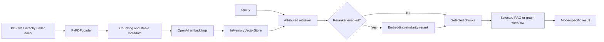
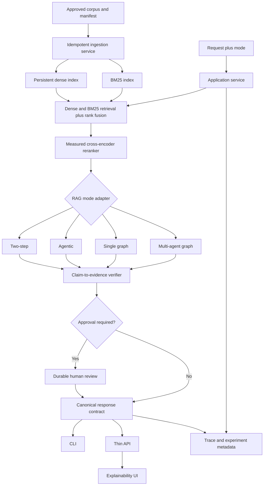

# Architecture

This document separates the repository's current implementation from its target
architecture. Unless a section is explicitly labeled **Target**, it describes
code that exists today.

## Current maturity

The project is a local prototype for comparing document-grounded RAG patterns.
It has multiple entry points, shared retrieval utilities, Phoenix/OpenTelemetry
instrumentation, and a small test suite. It does not yet have a shared
application-service boundary, a canonical response contract, a persistent
index, an HTTP API, or production deployment packaging.

## Current entry points

| Entry point | Data source | Orchestration | Current output |
|---|---|---|---|
| `app.main` | arXiv/web tools | LangChain tool-calling agent | `AgentResponse` |
| `app.rag.cli` (`two-step`) | `docs/*.pdf` | Retrieve once, then generate | Answer plus attributed sources |
| `app.rag.cli` (`agentic`) | `docs/*.pdf` | Model-controlled retrieval tool | Messages, tool calls, and sources |
| `app.rag.cli` (`compare`) | `docs/*.pdf` | Runs both RAG modes | Two mode-specific result objects |
| `app.graphs.agentic_rag_graph` | `docs/*.pdf` | Single typed LangGraph | Answer, sources, verifier state, retries |
| `app.graphs.multi_agent_graph` | `docs/*.pdf` | Orchestrator-led multi-agent graph | Answer, route history, sources, verifier state |
| `app.evaluation.run_ragas_eval` | Ten-question JSONL set and `docs/*.pdf` | Two-step RAG plus RAGAS evaluators | Console table and CSV |

The entry points do not currently share one response or error schema. The RAG
CLI selects a mode directly; there is no top-level router that chooses among all
four local-PDF workflows.

## Current local-PDF data flow

`app/rag/retriever.py` rebuilds the index when
`build_attributed_retriever()` is called. The loader reads every `*.pdf`
directly under `docs/`; it does not recurse into subdirectories. The current
optional reranker embeds the query and candidate chunks again and compares
cosine similarity. It is not a cross-encoder.

## Current component responsibilities

- `app/config.py` constructs the OpenAI-compatible chat client and the separate
  OpenAI embeddings client.
- `app/observability.py` registers Phoenix/OpenTelemetry and instruments
  LangChain calls.
- `app/rag/loaders.py` loads PDF pages and attaches source/page metadata.
- `app/rag/splitter.py` creates chunks and stable chunk metadata.
- `app/rag/vectorstore.py` builds the in-memory vector store.
- `app/rag/retriever.py` retrieves, optionally reranks, attaches attribution,
  and records retrieval spans.
- `app/rag/two_step_rag.py`, `app/rag/agentic_rag.py`, and
  `app/rag/compare.py` implement the CLI-selectable RAG modes.
- `app/graphs/agentic_rag_graph.py` implements the single graph, including
  rewrite, bounded retry, heuristic verification, and an interrupt branch.
- `app/graphs/multi_agent_graph.py` implements planner, retriever, explainer,
  verifier, routing, event streaming, and demo checkpoint persistence.
- `app/evaluation/run_ragas_eval.py` evaluates only the two-step baseline.

## Attribution and verification

Retrieved chunks can carry:

- `source`
- `page`
- `chunk_id`
- `retriever_score`
- `selected_rank`
- `reranker_score`
- `reason_selected`

The final shape depends on the selected workflow. Some paths preserve the full
attribution object, while the agentic CLI derives a smaller source list from
tool messages.

Graph verification currently calls `calculate_faithfulness_stub`, a token
overlap heuristic. Its score is useful for exercising conditional graph
routing, but it is not evidence that individual answer claims are entailed by
specific chunks.

## State, checkpoints, and human review

The single graph compiles with `InMemorySaver`, so its checkpoints live only in
the current process. It has an `interrupt()` branch and a `Command(resume=...)`
helper, but the command-line demo automatically supplies approval instead of
collecting a user decision. That is not a durable approval boundary.

The multi-agent graph combines `InMemorySaver` with LangGraph
`PersistentDict` stores and explicitly syncs them to
`.langgraph_checkpoints/multi_agent_graph.pkl`. This is useful for a local demo,
not a concurrent or production-grade state store.

## Observability

The research-assistant, RAG CLI, and graph module entry points call
`setup_phoenix_tracing()` before model or tool work. LangChain instrumentation
records model/tool spans, and the attributed retriever adds a
`rag.retrieve_with_attribution` span with retrieval metadata. The standalone
evaluation runner does not currently initialize Phoenix. The portable
development endpoint is configured through
`PHOENIX_COLLECTOR_ENDPOINT=http://localhost:6006/v1/traces`.

Traces can contain queries, retrieved document text, and model responses. Treat
the trace store as sensitive data and review it before sharing.

## Current boundaries and known gaps

- Chat and embeddings have separate credentials and endpoint behavior.
- Index construction is synchronous, paid, and repeated per retriever build.
- There is no corpus manifest, content-hash version, or document-level access
  policy.
- There is no lexical/BM25 retrieval or rank fusion.
- There is no measured cross-encoder reranker.
- Output and failure contracts vary by entry point.
- Human review is not interactive or durable.
- Only the two-step mode has a RAGAS runner.
- There are no HTTP, UI, CI, Docker application, or end-to-end layers.

## Target architecture

The following diagram is a roadmap, not the current implementation.

### Intended delivery order

1. Establish reproducible quality tooling, configuration, canonical schemas,
   errors, and an application-service seam.
2. Build a comparative harness and collect baseline evidence for all four
   modes.
3. Introduce claim-to-evidence verification and recalibrate routing with
   measured thresholds.
4. Add approved-corpus ingestion, persistent dense and BM25 indexes, fusion,
   and a benchmarked cross-encoder.
5. Add durable human review, then expose the stable contract through an API and
   UI.
6. Add trace-linked experiment evidence, CI, container packaging, security
   checks, and end-to-end validation.

Each target stage should preserve a runnable baseline and be accepted with
tests plus recorded evaluation evidence before the next layer is treated as
shipped.
